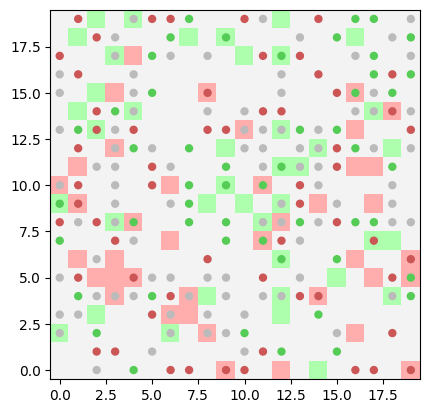
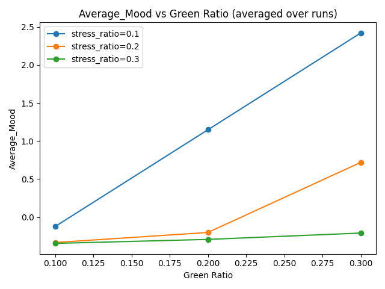
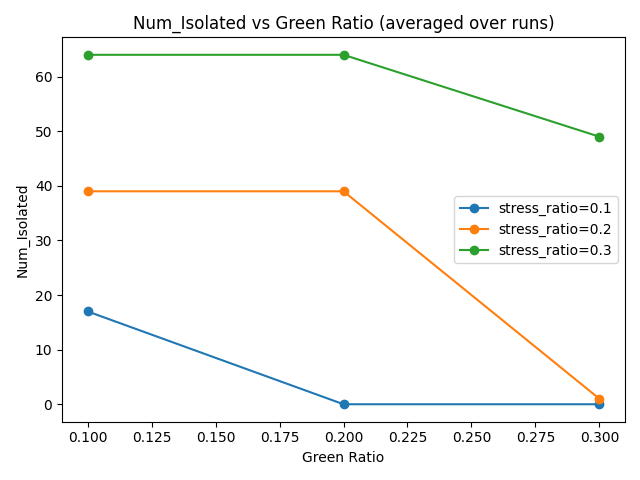
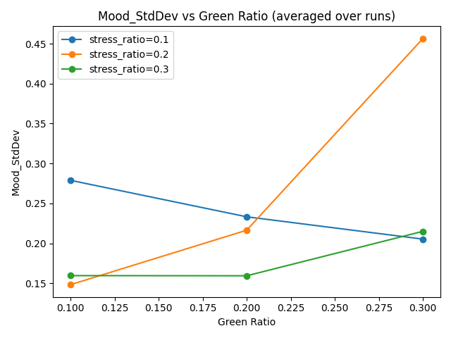

# Donghao Wu Final Project Proposal (Emotion Contagion)

This repository presents the results of a series of batch simulations using the `UrbanMoodModel`, an agent-based model that investigates emotional contagion in urban environments. The focus of these simulations is to understand how varying environmental compositions—specifically the proportions of green (positive) and stress (negative) zones—affect population-wide mood dynamics over time.



## Project Structure

- **batch_runner.py**: Script used to configure and execute batch simulations over different parameters.
- **result/batch_run_results.csv**: Raw output from the batch runs, containing aggregated data over multiple repetitions.
- **agents.py / model.py / app.py**: Core Mesa model files defining the agent behavior, model logic, and visualization app.
- **vis_batch.py**: Script used to visualize the results obtained from the batch run

## Parameters Explored

Each batch run varies the following parameters:

- `green_ratio`: Proportion of the grid designated as green (emotionally uplifting) zones.
- `stress_ratio`: Proportion of the grid designated as stress (emotionally draining) zones.
- `density`: Initial population density of agents on the grid.
- `seed`: Random seed for reproducibility.

Each combination of parameters was simulated for multiple repetitions to account for stochastic variation.

## Metrics Collected

For each run, the following metrics are collected at the end of the simulation:

- **average_mood**: Average final emotional state across all agents.
- **mood_std**: Standard deviation of final moods (indicating polarization or consensus).
- **agent_count**: Number of agents at the end of simulation (in case death or dropout is modeled).

## Visualization

The script includes matplotlib plots that display:
- Average mood across different `green_ratio` values for fixed `stress_ratio`
- Line plots grouped by `stress_ratio`, enabling visual comparison





## How to Reproduce

To run the batch simulations:
```
mesa version = 3.2.0
```
```bash
python batch_runner.py
```

To regenerate the analysis plots:

```bash
# In Jupyter Notebook or any Python script
import pandas as pd
import matplotlib.pyplot as plt
df = pd.read_csv('batch_run_results.csv')
# Plotting logic as provided in this repo
```

